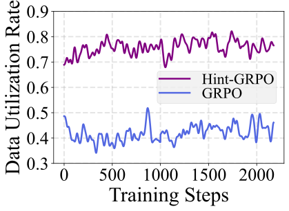

## <div align="center">  Boosting MLLM Reasoning with Text-Debiased Hint-GRPO </div>

<div align="center">

  <a href="https://arxiv.org/abs/2503.23905"></a> &ensp;
  <a href="https://huggingface.co/hqhQAQ/Hint-GRPO-Qwen2-VL-7B"></a> &ensp;
  <a href="https://huggingface.co/hqhQAQ/Hint-GRPO-Qwen2.5-VL-3B"></a> &ensp;

</div>

### Overview

This is the official implementation of paper "Boosting MLLM Reasoning with Text-Debiased Hint-GRPO" [[arXiv](https://arxiv.org/abs/2503.23905)], which proposes two methods to improve the original GRPO algorithm on the MLLMs.

⭐⭐~If you find the resources of this project (e.g., dataset, model weights, training code) helpful, please kindly leave a star here😊.

### Motivation

* **Low data utilization** of GRPO: If all answers are incorrect, the zero loss gradients ($\nabla_\theta\mathcal{L}=\mathbf{0}$) will invalidate the sample.

    <!--  -->
    <div style="display: flex; justify-content: center;">
    
    </div>

* **Text-bias** of GRPO, where the MLLM ignores real image and uses its imagined image from text to generate outputs.

    <!--  -->
    <div style="display: flex; justify-content: center;">
    
    </div>

### Observation

* **Data utilization rate:**

    <div style="display: flex; justify-content: center;">
    
    </div>

* **Qwen2-VL-7B's test accuracy** w/ \& w/o image in GRPO training:

    <div style="display: flex; justify-content: center;">
    
    </div>

### Method

To tackle these problems, this work proposes Hint-GRPO that improves data utilization by adaptively providing hints for samples of varying difficulty, and text-bias calibration that mitigates text-bias by calibrating the token prediction logits with image condition in test-time.
The framework of our method is shown as below:


### 🔥🔥🔥 News!!

- 📰 [2025.03.31] Our paper is available at [arXiv](https://arxiv.org/abs/2503.23905).
- 🤗 [2025.03.31] Our model weights are available at [Hugging Face](https://huggingface.co/hqhQAQ/Hint-GRPO-Qwen2-VL-7B) and [Hugging Face](https://huggingface.co/hqhQAQ/Hint-GRPO-Qwen2.5-VL-3B).
- 💬 [2025.06.26] Our paper is accepted by ICCV 2025!
- 🚀 [2025.07.01] Training code is available here.
- 🚀 [2025.07.01] Evaluation code is available here.

### Requirements

The python packages required for this project is listed as below:

```
torch==2.5.1
accelerate
codetiming
datasets
flash-attn==2.7.4
liger-kernel
mathruler
numpy
omegaconf
pandas
peft
pillow
pyarrow
pylatexenc
qwen-vl-utils
ray[default]
tensordict
torchdata
transformers==4.51.0
vllm==0.7.3
wandb
deepspeed==0.15.4
math_verify
```

### Dataset

* **Train dataset.** We choose the [LLaVA-CoT dataset](https://huggingface.co/datasets/Xkev/LLaVA-CoT-100k) as the training dataset. Download it and place it to `/PATH/TO/LLaVA-CoT-100k/`.

* **Test dataset.** Following [R1-V](https://github.com/Deep-Agent/R1-V), download the [Geo170K](https://huggingface.co/datasets/Luckyjhg/Geo170K) dataset and place it to `/PATH/TO/Geo170K/`. Unzip `images.zip`.

### Pre-trained models

* **Base models.** Two famous pre-trained MLLMs are required for training:

  * [Qwen2-VL-7B](https://huggingface.co/Qwen/Qwen2-VL-7B-Instruct)

  * [Qwen2.5-VL-3B](https://huggingface.co/Qwen/Qwen2.5-VL-3B-Instruct)

* **Evaluation.** Our trained Hint-GRPO models can be downloaded from:

  * [Hint-GRPO-Qwen2-VL-7B](https://huggingface.co/hqhQAQ/Hint-GRPO-Qwen2-VL-7B)

  * [Hint-GRPO-Qwen2.5-VL-3B](https://huggingface.co/hqhQAQ/Hint-GRPO-Qwen2.5-VL-3B)

The path of these models will be `/PATH/TO/Qwen2-VL-7B-Instruct/`, `/PATH/TO/Qwen2.5-VL-3B-Instruct/`, `/PATH/TO/Hint-GRPO-Qwen2-VL-7B/`, and `/PATH/TO/Hint-GRPO-Qwen2.5-VL-3B/` respectively.

### Training

* Train Hint-GRPO based on `Qwen2-VL-7B` model on a node of 8 GPUs (note that `/PATH/TO` in `--model_name_or_path` and `--data_path` should be changed to your own path).

  ```
  torchrun --nproc_per_node=7 \
    --nnodes 1 \
    --node_rank 0 \
    --master-addr localhost \
    --master-port 7001 \
    train_model.py \
    --deepspeed local_scripts/zero3_offload.json \
    --model_name_or_path /PATH/TO/Qwen2-VL-7B-Instruct/ \
    --data_path /PATH/TO/LLaVA-CoT-100k/ \
    --dataset_name LLaVA-CoT-100k \
    --max_prompt_length 8192 \
    --max_completion_length 768 \
    --per_device_train_batch_size 1 \
    --gradient_accumulation_steps 1 \
    --num_groups 2 \
    --num_generations 4 \
    --logging_steps 1 \
    --bf16 \
    --torch_dtype bfloat16 \
    --gradient_checkpointing true \
    --attn_implementation flash_attention_2 \
    --max_pixels 2359296 \
    --save_total_limit 16 \
    --num_train_epochs 2 \
    --eval_strategy no \
    --reward_funcs accuracy \
    --use_vllm true \
    --vllm_gpu_memory_utilization 0.6 \
    --save_steps 500 \
    --save_only_model true \
    --output_dir output/exp_Qwen2-VL-7B
  ```

* Train Hint-GRPO based on `Qwen2.5-VL-3B` model on a node of 8 GPUs (note that `/PATH/TO` in `--model_name_or_path` and `--data_path` should be changed to your own path).

  ```
  torchrun --nproc_per_node=7 \
    --nnodes 1 \
    --node_rank 0 \
    --master-addr localhost \
    --master-port 7001 \
    train_model.py \
    --deepspeed local_scripts/zero3_offload.json \
    --model_name_or_path /PATH/TO/Qwen2.5-VL-3B-Instruct/ \
    --data_path /PATH/TO/LLaVA-CoT-100k/ \
    --dataset_name LLaVA-CoT-100k \
    --max_prompt_length 8192 \
    --max_completion_length 768 \
    --per_device_train_batch_size 1 \
    --gradient_accumulation_steps 1 \
    --num_groups 2 \
    --num_generations 4 \
    --logging_steps 1 \
    --bf16 \
    --torch_dtype bfloat16 \
    --gradient_checkpointing true \
    --attn_implementation flash_attention_2 \
    --max_pixels 2359296 \
    --save_total_limit 16 \
    --num_train_epochs 2 \
    --eval_strategy no \
    --reward_funcs accuracy \
    --use_vllm true \
    --vllm_gpu_memory_utilization 0.6 \
    --save_steps 500 \
    --save_only_model true \
    --output_dir output/exp_Qwen2.5-VL-3B
  ```

### Evaluation

* Inference based on `Hint-GRPO-Qwen2-VL-7B` model (`/PATH/TO` should be changed to your own path):

  * Without text-bias calibration:

    ```
    python test_model.py \
      --model_path /PATH/TO/Hint-GRPO-Qwen2-VL-7B/ \
      --data_path /PATH/TO/Geo170K/ \
      --prompt_path ./eval/prompts/geoqa_test_prompts.jsonl \
      --scale 0.0
    ```

  * With text-bias calibration:

    ```
    python test_model.py \
      --model_path /PATH/TO/Hint-GRPO-Qwen2-VL-7B/ \
      --data_path /PATH/TO/Geo170K/ \
      --prompt_path ./eval/prompts/geoqa_test_prompts.jsonl \
      --scale 0.8
    ```

* Inference based on `Hint-GRPO-Qwen2.5-VL-3B` model (`/PATH/TO` should be changed to your own path):

  * Without text-bias calibration:

    ```
    python test_model.py \
      --model_path /PATH/TO/Hint-GRPO-Qwen2.5-VL-3B/ \
      --data_path /PATH/TO/Geo170K/ \
      --prompt_path ./eval/prompts/geoqa_test_prompts.jsonl \
      --scale 0.0
    ```

  * With text-bias calibration:

    ```
    python test_model.py \
      --model_path /PATH/TO/Hint-GRPO-Qwen2.5-VL-3B \
      --data_path /PATH/TO/Geo170K/ \
      --prompt_path ./eval/prompts/geoqa_test_prompts.jsonl \
      --scale 0.8
    ```